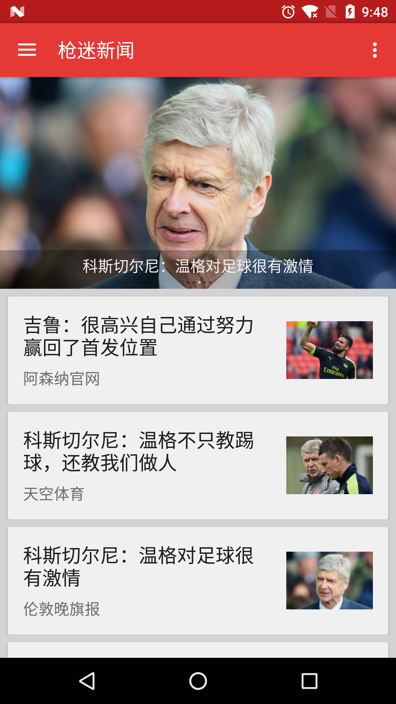
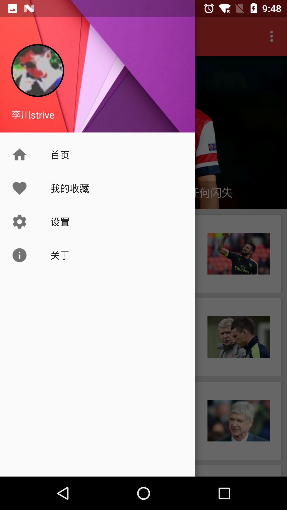
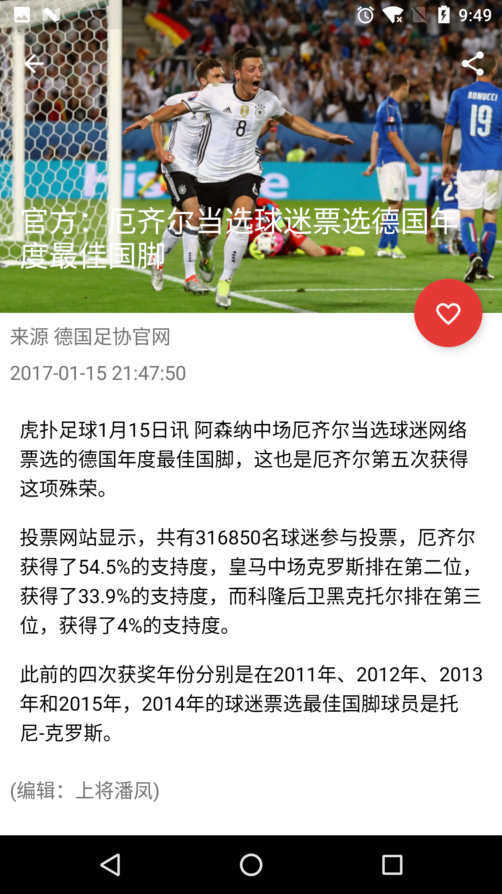

#Arsenal News

Please check the new version [Arsenal news android client](https://github.com/lichuan0217/arsenal_news), which use MVP and Dagger2.

Arsenal News is an open source news display android application.

## Screen Shots

## Data Source
The news data is crawled from [Arsenal Voice](http://voice.hupu.com/o/arsenal) of [Hupu Soccer](https://soccer.hupu.com/) by [Scrapy](https://scrapy.org/).
You can find the Scrapy source code from [arsenal-crawler repo](https://github.com/lichuan0217/arsenal-crawler).

## Backend Server
The crawled data are store in [MongoDB](https://www.mongodb.com/). The backend server are supported by [Flask](http://flask.pocoo.org/).
You can find the backend server source code from [arsenal-server repo](https://github.com/lichuan0217/arsenal-server).

## Android Client

- Request news data via [Retrofit](http://square.github.io/retrofit/)
- Login via Weibo
- Receive latest news by [JPush](https://www.jiguang.cn/push)
